# Vibe Starter — Day 1

디자이너를 위한 바이브 코딩 입문 가이드. 개발 환경을 세팅하고, 내 손으로 만든 Next.js 포트폴리오를 GitHub에 올려 Vercel로 배포하는 과정까지 한 번에 경험합니다.

---

## A. 준비하기

### 1) 개발 환경 설치

바이브 코딩을 시작하려면 기본 도구 두 가지가 필요합니다. **Git**은 코드 버전 관리, **Node.js**는 웹 프로젝트 실행 환경입니다.

#### Git 설치
- Windows: https://git-scm.com/install/windows
- macOS: https://git-scm.com/install/mac

#### Node.js 설치
https://nodejs.org/ko/download

자신의 OS/CPU에 맞는 버전을 선택하세요.

| 환경 | 선택할 설치 파일 |
|---|---|
| Windows (x64) | Windows 설치 프로그램 (.msi) |
| Intel Mac (x64) | macOS 설치 프로그램 (.pkg) |
| Apple Silicon Mac (ARM64) | macOS 설치 프로그램 (.pkg) |

> Mac 사용자는 Apple 로고 → "이 Mac에 관하여"에서 칩 종류를 확인할 수 있습니다. "Apple M1/M2/..." 이면 ARM64입니다.

---

### 2) 코딩 AI 설치

자신이 구독한 서비스 중 **하나**를 골라 설치하면 됩니다.

#### 2-1) 데스크탑 앱

| 서비스 | 다운로드 |
|---|---|
| OpenAI Codex | https://openai.com/ko-KR/codex/ |
| Google Antigravity | https://antigravity.google/download |
| Anthropic Claude | https://claude.com/download |

#### 2-2) CLI (명령줄 도구)

CLI는 터미널에서 AI와 직접 대화하며 코드를 작성하는 방식입니다. 이번 바이브 코딩에서 주력 도구로 쓰지 않더라도 **한 번쯤 써보길 권장**합니다. AI 에이전트가 실제로 어떻게 파일을 읽고 명령을 실행하는지 감을 잡는 데 큰 도움이 됩니다.

| 서비스 | 설치 가이드 |
|---|---|
| OpenAI Codex CLI | https://developers.openai.com/codex/cli |
| Gemini CLI | https://geminicli.com/ |
| Claude Code | https://code.claude.com/docs/ko/overview |

#### 2-3) VSCode
코드 에디터. 거의 모든 AI 코딩 확장과 호환됩니다.
https://code.visualstudio.com/

---

### 3) GitHub, Vercel 가입

- **GitHub** — 소스 코드 저장소이자 협업 플랫폼: https://github.com/
- **Vercel** — 만든 웹 서비스를 세상에 공개하는 배포 플랫폼: https://vercel.com/

> 개별 과제가 웹서비스가 아니라면 Vercel은 건너뛰어도 괜찮습니다.

---

## B. 시작하기

### 1) README.md 만들고 GitHub에 올리기

먼저 프로젝트 폴더에 `README.md` 파일을 만듭니다. 내용은 **AI에게 "내 프로젝트 소개글 써줘"** 라고 부탁하면 됩니다.

#### 단계별 스크린샷 가이드

**① GitHub 대시보드에서 New repository 선택**

우측 상단 `+` 버튼 → `New repository`.

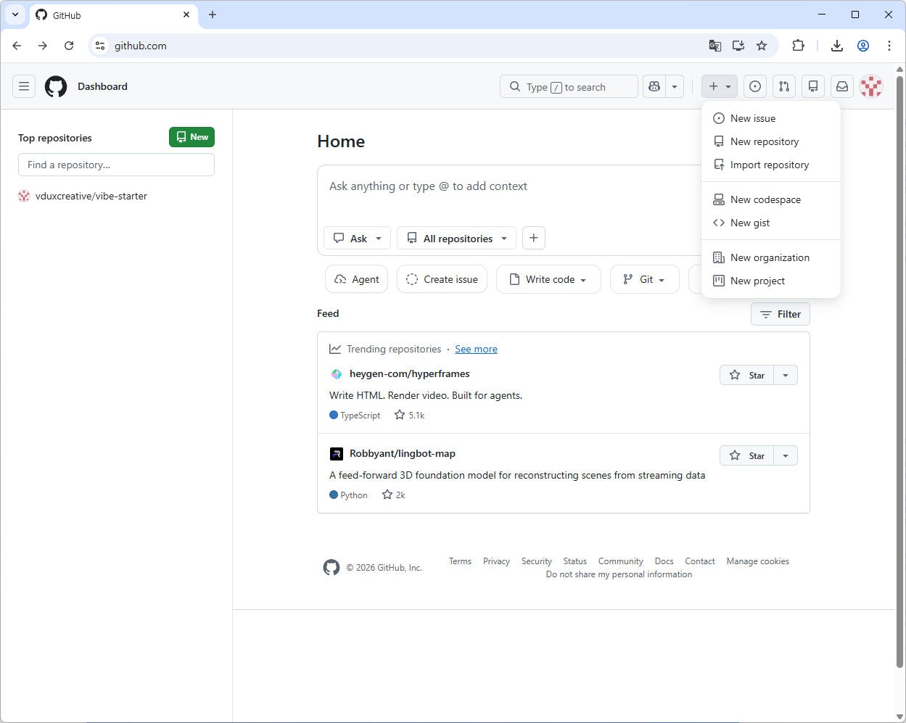

**② 저장소 이름 입력 후 생성**

`Repository name`에 프로젝트 이름을 적고 (예: `vibe-coding-study`), `Public`으로 두고 `Create repository`.

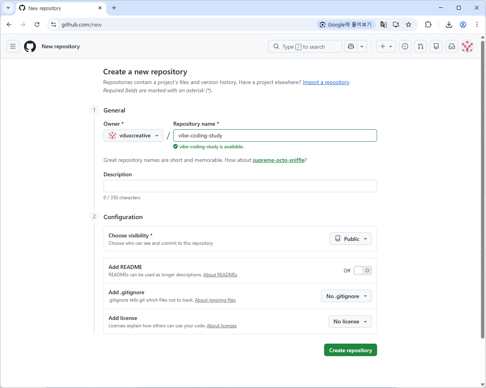

**③ Quick setup 명령어 확인**

생성 직후 나타나는 화면에서 CLI 명령어를 복사합니다.

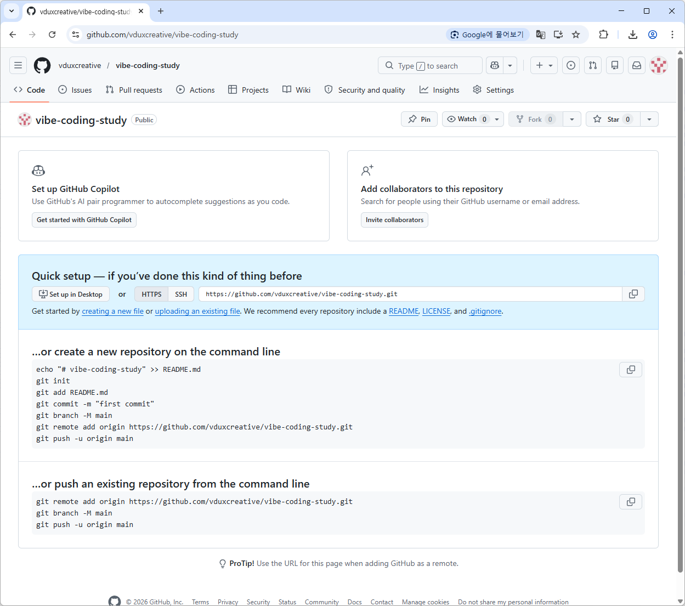

**④ 터미널에서 명령어 한 줄씩 실행**

프로젝트 폴더에서 터미널을 열고 아래 명령을 순서대로 입력하세요. `YOUR_NAME`, `YOUR_EMAIL`, `YOUR_REPO_URL`은 본인 값으로 바꿉니다.

```bash
git config --global user.name "YOUR_NAME"
git config --global user.email "YOUR_EMAIL"
git init
git add README.md
git commit -m "first commit"
git branch -M main
git remote add origin https://github.com/USERNAME/REPO.git
git push -u origin main
```

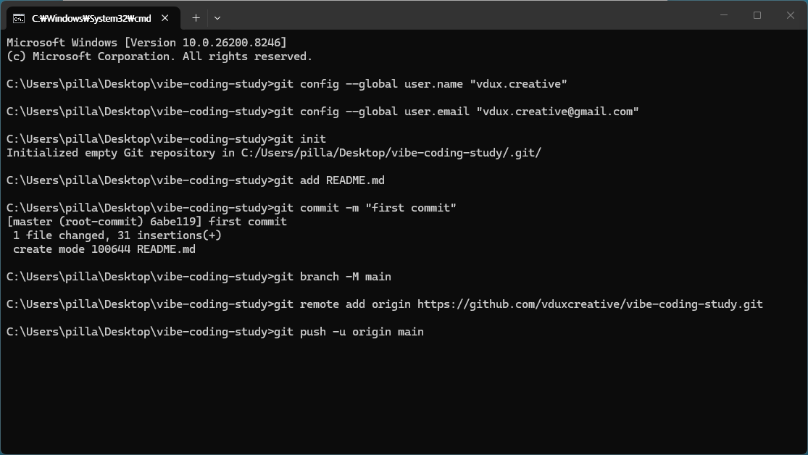

**⑤ Git Credential Manager 인증**

처음 `push`할 때 브라우저가 열립니다. `Authorize git-ecosystem` 버튼을 눌러 GitHub 계정을 연결합니다.

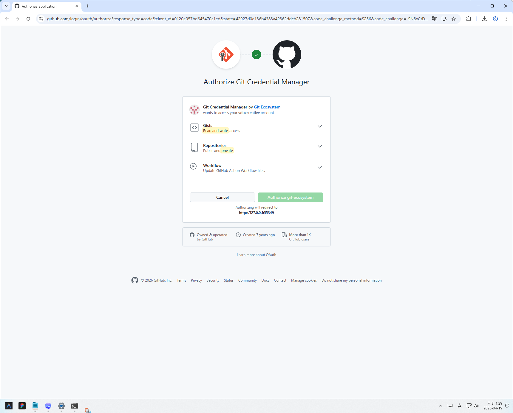

**⑥ 업로드 확인**

GitHub 저장소 페이지를 새로고침하면 `README.md`가 올라온 걸 볼 수 있습니다.

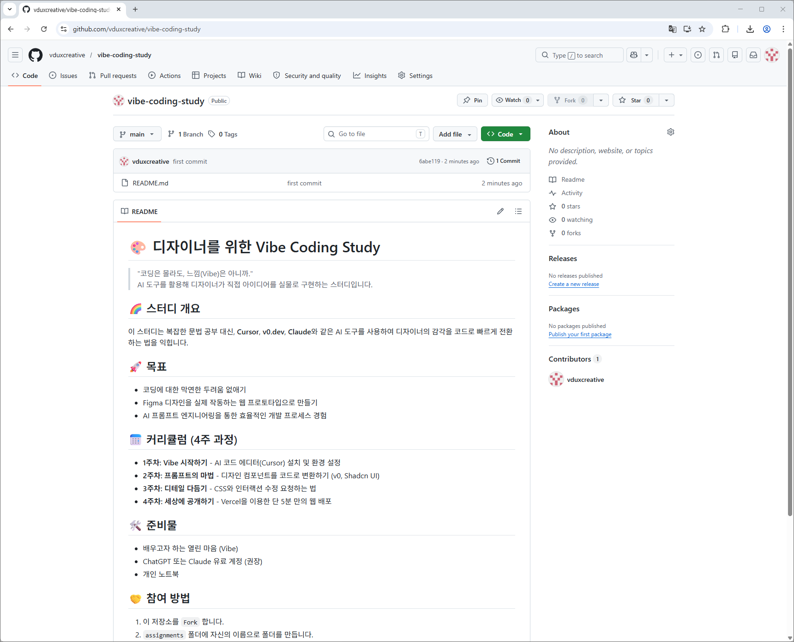

---

### 2) 나만의 포트폴리오 사이트 만들어보기

이 저장소는 이미 Next.js로 세팅되어 있습니다. 의존성 설치 후 개발 서버를 켜보세요.

```bash
npm install
npm run dev
```

브라우저에서 다음 주소를 열면 화면이 뜹니다.

```
http://localhost:3000
```

> 여기서부터가 진짜 바이브 코딩. AI에게 "랜딩 섹션을 이렇게 바꿔줘", "내 프로젝트 카드 추가해줘" 라고 요청해보세요.

---

### 3) 배포하기 (Vercel)

로컬에서만 돌아가던 사이트를 **인터넷 주소가 있는 진짜 웹사이트**로 만드는 과정입니다.

**① Vercel 대시보드 → Add New... → Project**

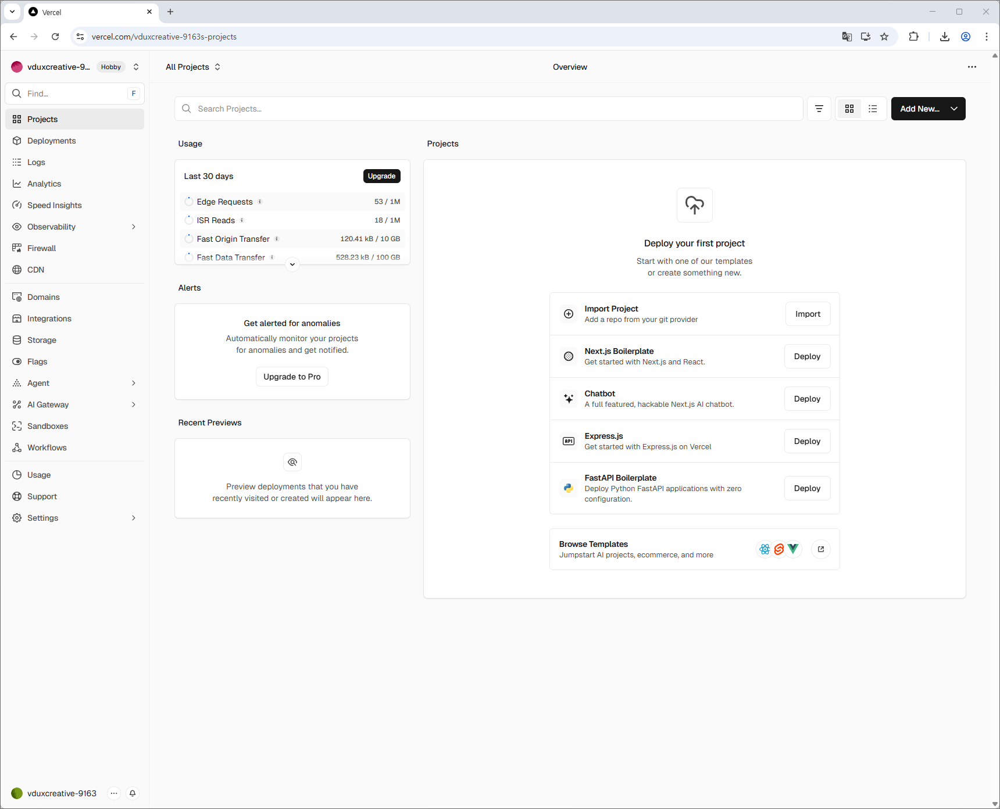

**② Import Git Repository → Continue with GitHub**

GitHub 계정을 Vercel에 연결합니다 (처음 한 번만).

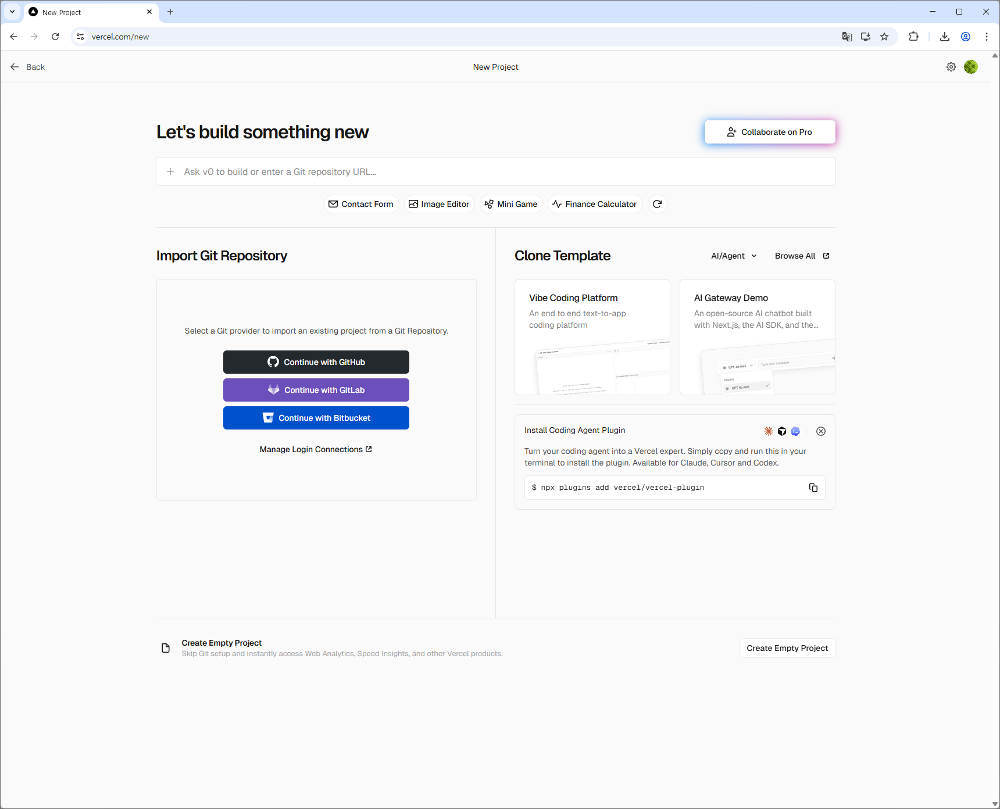

**③ 방금 만든 저장소를 `Import`**

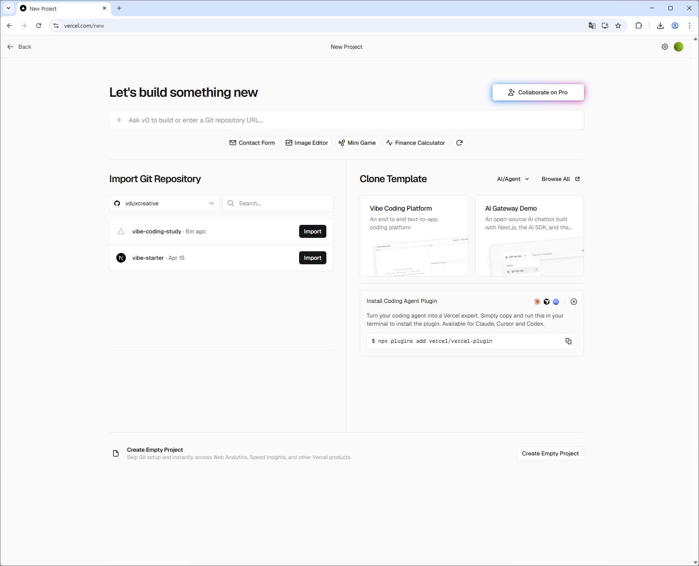

**④ Framework Preset 확인 후 `Deploy`**

Next.js 프로젝트라면 자동으로 감지됩니다. 그대로 `Deploy`.

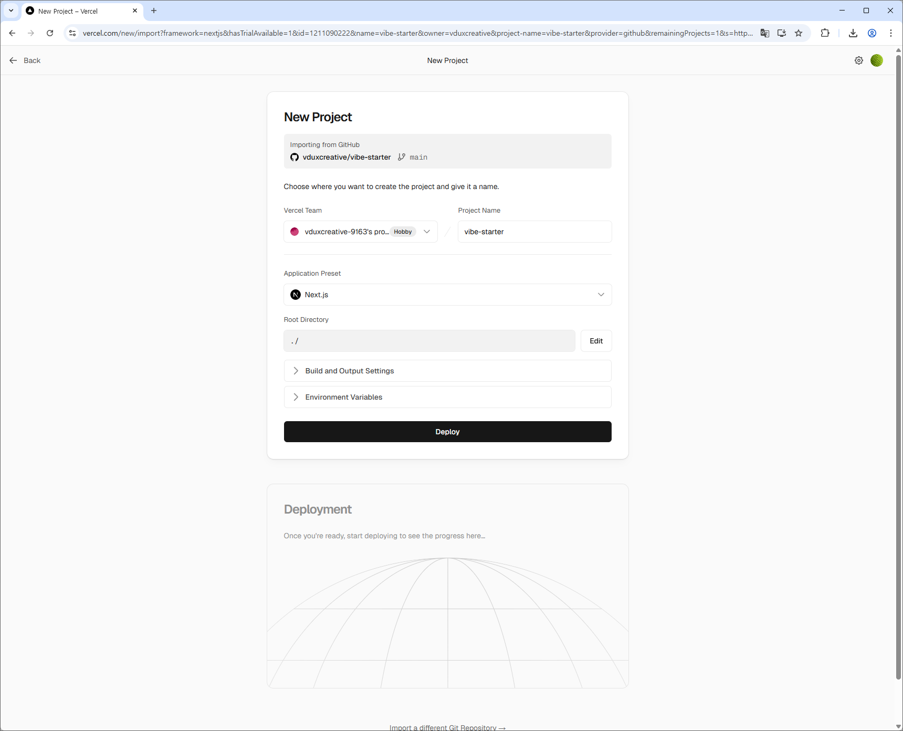

**⑤ 배포 완료 → 도메인 클릭해서 확인**

몇 초~몇 분 뒤 `your-project.vercel.app` 주소가 발급됩니다. 이제 이 링크를 누구에게나 공유할 수 있습니다.

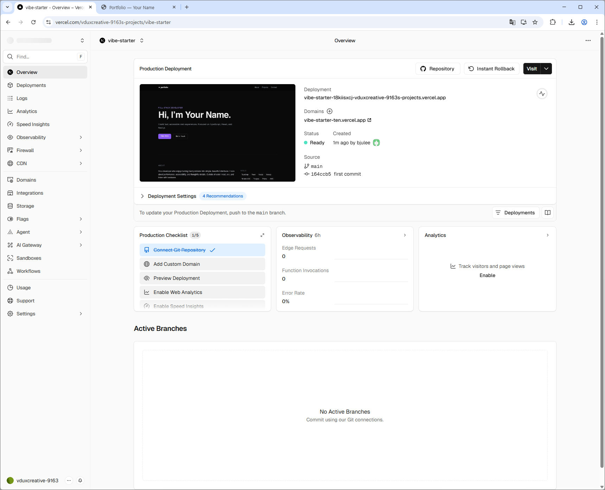

---

## 참고

- 이후 코드를 바꾸고 `git push` 할 때마다 **Vercel이 자동으로 재배포**합니다.
- AI에게 뭔가를 시킬 때는 "무엇을 하고 싶은지 + 결과가 어때 보였으면 좋겠는지"를 같이 전달하면 훨씬 좋은 결과가 나옵니다.
